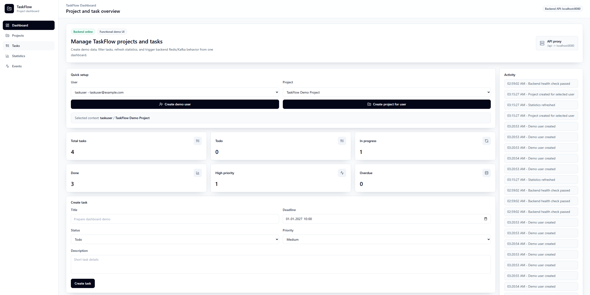
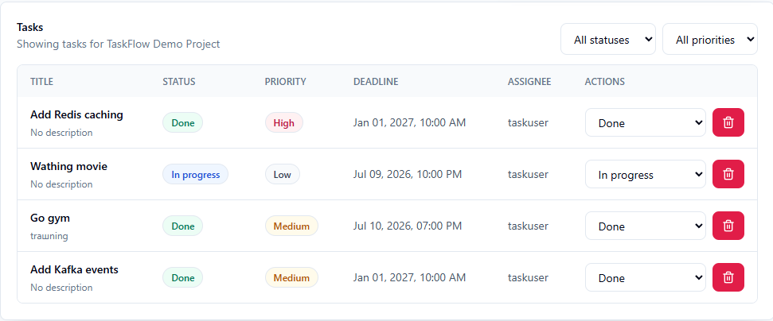
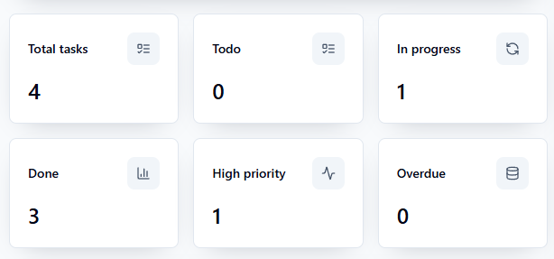
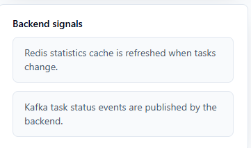

# TaskFlow API

TaskFlow API is a backend REST API for project and task management. It demonstrates a modern Java backend stack with Spring Boot, PostgreSQL, Liquibase, Redis caching, Kafka events, Docker Compose, Postman and unit tests.

## Screenshots

TaskFlow includes a React demo frontend dashboard that connects to the Spring Boot backend API and demonstrates project management, task management, statistics, Redis cache invalidation and Kafka task status events.

### Dashboard



### Task Management



### Project Statistics



### Activity Panel



## Features

- User management
- Project management
- Task management
- Task status and priority
- Task filtering by status and priority
- Project task statistics
- Redis caching for project statistics
- Kafka event publishing on task status changes
- Validation and unified error responses
- Postman collection for API testing and documentation
- Unit tests

## Tech Stack

- Java 21
- Spring Boot 3
- Maven
- PostgreSQL 18
- Liquibase
- Spring Data JPA / Hibernate
- Redis 8
- Apache Kafka
- Docker Compose
- JUnit 5
- Mockito
- Postman

## Architecture Overview

```text
Client / Postman
    |
REST Controllers
    |
Services
    |
Repositories
    |
PostgreSQL
```

- Redis caches project statistics.
- Kafka publishes task status change events.

## Project Structure

```text
src/main/java/com/taskflow
|-- config
|-- controller
|-- dto
|-- entity
|-- enums
|-- exception
|-- kafka
|-- mapper
|-- repository
`-- service

src/main/resources
`-- db/changelog

src/test/java/com/taskflow/service

postman
```

## How To Run

Prerequisites:

- Java 21
- Docker and Docker Compose
- Maven is optional if Maven Wrapper is present

Start infrastructure:

```bash
docker compose up -d
```

Run application on Windows PowerShell:

```bash
.\mvnw.cmd spring-boot:run
```

PowerShell requires `.\` when running scripts from the current directory.

Run application on Linux/macOS:

```bash
./mvnw spring-boot:run
```

If Maven Wrapper is not available, use Maven directly:

```bash
mvn spring-boot:run
```

## Services

- Application: http://localhost:8080
- PostgreSQL: localhost:5433
- Redis: localhost:6379
- Kafka: localhost:9092

## Frontend

The demo React dashboard is located in `frontend/`. Start the backend on `http://localhost:8080`, then run:

```bash
cd frontend
npm install
npm run dev
```

On Windows PowerShell, if the browser cannot reach the dev server through the default host, run:

```bash
cd frontend
npm run dev -- --host 127.0.0.1
```

The frontend dev server starts on `http://localhost:5173` or `http://127.0.0.1:5173/` and proxies `/api` requests to the backend.
It supports demo user/project setup, task management, filtering, statistics, and Redis/Kafka demonstration messages.

## Health Check

```http
GET http://localhost:8080/api/health
```

Expected response:

```json
{
  "status": "UP",
  "service": "TaskFlow API"
}
```

## API Endpoints

Health:

```http
GET /api/health
```

Users:

```http
POST /api/users
GET /api/users
GET /api/users/{id}
```

Projects:

```http
POST /api/projects
GET /api/projects
GET /api/projects/{id}
GET /api/projects/owner/{ownerId}
DELETE /api/projects/{id}
GET /api/projects/{projectId}/stats
```

Tasks:

```http
POST /api/projects/{projectId}/tasks
GET /api/projects/{projectId}/tasks
GET /api/projects/{projectId}/tasks?status=TODO
GET /api/projects/{projectId}/tasks?priority=HIGH
GET /api/projects/{projectId}/tasks?status=TODO&priority=HIGH
GET /api/tasks/{id}
PATCH /api/tasks/{id}
PATCH /api/tasks/{id}/status
DELETE /api/tasks/{id}
```

## Example Requests

Create user:

```http
POST /api/users
```

```json
{
  "username": "daniil",
  "email": "daniil@example.com"
}
```

Create project:

```http
POST /api/projects
```

```json
{
  "name": "TaskFlow API",
  "description": "Portfolio project",
  "ownerId": 1
}
```

Create task:

```http
POST /api/projects/1/tasks
```

```json
{
  "title": "Implement README",
  "description": "Prepare project documentation",
  "status": "TODO",
  "priority": "HIGH",
  "deadline": "2027-01-01T10:00:00",
  "assigneeId": 1
}
```

Update task status:

```http
PATCH /api/tasks/1/status
```

```json
{
  "status": "IN_PROGRESS"
}
```

## Error Response Format

```json
{
  "code": "project.not.found",
  "message": "Project with id 999999 not found"
}
```

Common error codes:

- `user.not.found`
- `project.not.found`
- `task.not.found`
- `validation.error`

## Redis Caching

`GET /api/projects/{projectId}/stats` is cached in Redis. The first request calculates statistics from PostgreSQL, and the next request returns the cached result. Cache is evicted when a task is created, updated, status-changed or deleted.

## Kafka Events

When a task status changes, the application publishes an event to Kafka topic `task-events`. The consumer receives and logs the event.

Example event:

```json
{
  "taskId": 13,
  "projectId": 5,
  "eventType": "TASK_STATUS_CHANGED",
  "oldStatus": "TODO",
  "newStatus": "IN_PROGRESS",
  "createdAt": "2027-01-01T10:00:00"
}
```

## Postman

- Import `postman/TaskFlow_API.postman_collection.json`
- Import `postman/TaskFlow_Local.postman_environment.json`
- Select `TaskFlow Local`
- Run requests in order: Health -> Users -> Projects -> Tasks -> Filtering -> Statistics -> Redis Cache Check -> Kafka Event Check
- Use Postman as the API testing and documentation tool for local verification.

## Tests

Run tests on Windows PowerShell:

```bash
.\mvnw.cmd test
```

Compile on Windows PowerShell:

```bash
.\mvnw.cmd clean compile
```

Run tests on Linux/macOS:

```bash
./mvnw test
```

If Maven Wrapper is not available:

```bash
mvn test
```

Unit tests cover the service layer. Current tests include `UserService`, `ProjectService`, `TaskService` and `ProjectStatisticsService`.

## Useful Docker Commands

```bash
docker compose up -d
docker compose down
docker compose down -v
```

View containers:

```bash
docker ps
```

Redis keys:

```bash
docker exec -it taskflow-redis redis-cli KEYS "*"
```

Kafka topics:

```bash
docker exec -it taskflow-kafka /opt/kafka/bin/kafka-topics.sh --bootstrap-server localhost:9092 --list
```

## Project Status

This is a portfolio backend project. Authentication is not included in v1 and may be added later.
